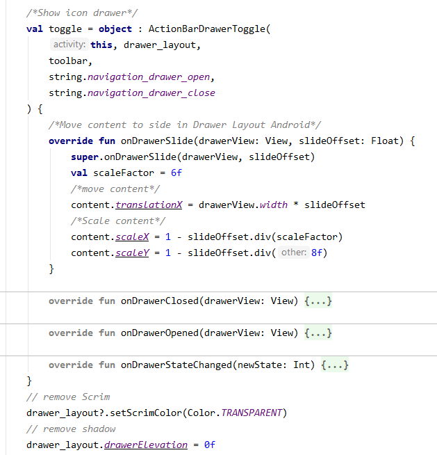

# Navigation Drawer

## Overview
### Notification Drawer là gì?
- Navigation Drawer là một menu kéo, cung cấp quyền truy cập vào các điểm đến trong ứng dụng.
- Click icon hoặc có thể vuốt từ trái sang để hiển thị. Và khi không sử dụng nó sẽ ẩn đi.

### Khi nào nên sử dụng Navigation Drawer
- App có từ 5 tab trở lên.
- App có 2 hoặc nhiều phân cấp điều hướng
- Điều hướng nhanh giữa 2 điểm đến không liên quan đến nhau.

- Chú ý: Tránh sử dụng Navigation Drawer với một thành phần điều hường chính khác, như là Bottom navigation.

### Nguyên tắc
- Vị trí và kiểu danh sách nội dung của Navigation Drawer định nghĩa rõ ràng.
- Sắp xếp các điểm đến theo mức độ quan trọng của người dùng: Các destination thường sử dụng trước, nhóm các destination có liên quan với nhau.
- Có thể ẩn hoặc hiện để hiện thị những bố cục khác app.

### Navigation drawer types
- Standard drawer:
	+ cho phép users truy cập đồng thời drawer destinations và nội dung app. Chúng thường cùng cấp với nội dung app và có ảnh hưởng đến bố cục màn hình.
	+ Có thể hiển thị vĩnh viễn hoặc đóng/mở bằng cách tapping vào navigation menu icon.
	+ Chỉ có thể sử dụng trên tablet và desktop, với mobile sử dụng modal drawers thay thế.

	

- Modal drawer:
	+ Sử dụng một scrim để chặn tương tác với phần còn lại của nội dung app, không ảnh hưởng đến bố cục màn hình
	+ Chủ yếu sử dụng trên thiết bị di động, nơi không gian màn hình bị hạn chế.
	
	

- Bottom drawer:
	+ Là một drawer chuyên dụng được sử dụng cùng với bottom app bar.
	+ Xuất hiện từ dưới lên.
	
	

### Thành phần

- 1: Container
- 2: Header (optional)
- 3: Divider (optional)
- 4: Active text overlay
- 5: Active text
- 6: Inactive text
- 7: Subtitle
- 8: Scrim (modal only)

## Modal drawer
- Modal drawer chặn tương tác với phần còn lại của app bằng scrim, không ảnh hưởng đến bố cục giao diện.
- Sử dụng trên mobile, và có thể thay thế được cho standard drawer trên tablet và desktop.
### Behavior
- Opening: Sử dụng drawer item/ vuốt từ vị trí navigation drawer neo.
- Closing:
	+ Selecting a drawer item
	+ Tapping the scrim
	+ Vuốt về phí drawer neo.
- Scrolling: Nếu danh sách destination dài hơn chiều cao của drawer, có thể cuộc theo chiều dọc drawer.
### Specs

## Bottom drawer
- Là Modal drawer được neo ở dưới cùng thay vì cạnh bên màn hình. Chỉ được sử dụng với bottom app bar.
### Behavior
- Opening (portrait orientation):
	+ Nếu nội dung drawer nhỏ hơn 50% chiều cao, hiển thị đầy đủ drawer
	+ Nếu nội dung drawer lớn hơn 50% chiều cao, hiện thị drawer đến 50% màn hình, cho phép users kéo lên đến toàn bộ chiều cao của nó hoặc full screen height.

	

- Opening (landscape orientation)
	+ Bottom navigation drawer cao hơn sẽ tự động mở sang chế độ full-screen.
- Scrolling: Bottom navigation drawer có thể scroll khi nó đã được mở đến full screen height.
### Specs

## Implementation

### Step 1: Triển khai DrawerLayout làm root view
- activity_main: Triển khai thẻ DrawerLayout, thêm layout cho main UI và các view khác chứa nội dung của Navigation Drawer.

	
	+ app_bar_main: Nội dung bố cục của app.
	+ nav_header_main (optional)
	+ activity_main_drawer: menu hiển thị trong NavigationView

### Step 2: Viết code - MainActivity
- Method onCreate: Để hiển thị icon drawer ta sử dụng ActionBarDrawerToggle

	

- Lắng nghe click vào menu:

	

- Close navigation drawer khi nhấn BackPress:

	

### Kết quả

## Custom Navigation Drawer
### Custom List Item: Ta có thể custom lại giao diện hiển thị của NavigationView, chẳng hạn như thêm 1 label thay vì chỉ có icon và label.
- Step 1:
	+ Ta custom lại một chút NavigationView, sử dụng RecyclerView.

	

	+ item_destination

	

	+ NavigationAdapter:

	

- Step 2: Viết code - MainActivityCustom
	+ Tạo data cho NavigationView

	

	+ Hiển thị NavigationView

	
	
	+ Xử lý sự kiện
	
	

- Kết quả:

### Move content to side in Drawer Layout
- Thực hiện di chuyển nội dung sang một bên, như ví dụ sau:

	+ Làm trong suốt Scrim
	+ Sử dụng method onDrawerSlide trong ActionBarDrawerToggle để di chuyển nội dung sang bên.
	+ Có thể scale nội dung nhỏ lại
	+ Đôi khi drawer có shadow, có thể loại bỏ nó.

	

- Kết quả: 

## Navigation Drawer với Navigation Component
- Trước hết bạn cần phải biết về Navigation Component: https://developer.android.com/guide/navigation
- Tạo nav_graph.xml
- Tạo fragment chứa các destination của Navigation Component.

	

- Kết nối DrawerLayout với Navigation Graph:

	

- Chú ý: id của fragment trong navigation graph phải trùng với id của menu navigation.

## Tham khảo
- https://material.io/design/components/navigation-drawer.html#implementation
- https://material.io/develop/android/components/navigation-view/
- https://developer.android.com/reference/android/support/v4/widget/DrawerLayout.html
- https://medium.com/quick-code/android-navigation-drawer-e80f7fc2594f
- http://thetechnocafe.com/slide-content-to-side-in-drawer-layout-android/
- https://github.com/umangburman/Navigation-Drawer-With-Navigation-Component
